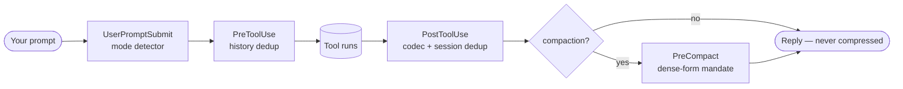
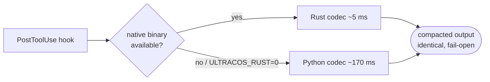

# UltraCoS — token-cost reduction for Claude Code

UltraCoS is a Claude Code plugin that lowers token cost across a session without
changing what the agent can see. It compacts tool-result output, removes repeated
content, and steers compaction toward a dense form — all **lossless by meaning**,
**fail-open** (any error passes the original through untouched), and fast (a
prebuilt native binary on the hot path, Python as the portable fallback).

It is free for noncommercial use (PolyForm Noncommercial 1.0.0); commercial use
needs a paid license — see [COMMERCIAL.md](COMMERCIAL.md).

---

> **Your agent's tool output is mostly noise** — ANSI codes, repeated reads,
> machine chatter, verbose compaction summaries. UltraCoS strips it **losslessly,
> on-device, before it bills** — and stacks *on top of* Anthropic's prompt cache.

| Measured | Reduction | On |
|---|---:|---|
| Tool-heavy session corpus (52 real fixtures) | **−31.7%** | total tokens 85,405 → 58,347 |
| Large `Bash` dumps | **−71.1%** | the noisiest payloads |
| Instruction prose in the ULTRACOS-L1 dialect | **−44.6%** | every cached system-prompt call |
| Network calls · API keys · data leaving your machine | **0** | 100% local, fail-open |

<sub>Numbers are reproducible from [`bench/`](./bench/) (`codec_bench.py`), not asserted. Dialect figure: `opus-dialect-validate-2026-05-31`. The project does not publish figures it has not measured.</sub>

## How it works

UltraCoS hooks the request lifecycle at six points; every one fails open
(`{"continue": true}` on any error — it can never block your input):



It does **not** fight Anthropic's cache — it works on a different token bucket.
Native caching discounts what is *already cached*; UltraCoS shrinks the
turn-to-turn traffic that changes every call and therefore *never* caches, plus
the dense form of what *does* get cached. The two stack:


The hot path is a prebuilt native binary; Python is the portable fallback:



## Quickstart — first 5 minutes

```sh
claude plugin marketplace add MikkoParkkola/ultracos
claude plugin install ultracos
```

1. **Restart your session.** Hooks fire automatically — nothing to configure.
2. **Use Claude normally** for a few tool-heavy turns (reads, greps, bash).
3. **Check what it saved:** run `ultracos-stats` — it reads the append-only audit
   log and prints per-tool savings (so the effect is measured, not asserted).
4. **Tune aggressiveness** with `ultracos-set-level` if you want more or less.
5. **Verify losslessness yourself:** `echo "<dense prose>" | ultracos-core compress | ultracos-core expand` round-trips byte-for-byte.

Nothing leaves your machine; if anything errors, the original output passes
through untouched. To pause, set `ULTRACOS_DISABLE=1`.

## How it compares

UltraCoS is one layer in the token-cost stack, not a replacement for the others —
it composes with native caching and is a different shape from edge proxies and
learned compressors:

| | UltraCoS | Anthropic cache alone | Edge proxy (e.g. Edgee) | Learned compressor (e.g. LLMLingua-2) |
|---|---|---|---|---|
| Where it runs | in-process plugin | platform | hosted proxy hop | local model |
| Acts on | tool results + compaction + dialect | already-cached prefixes | tool results + output | prompt text |
| Network hop | none | n/a | yes | none (loads a model) |
| Reversibility | lossless by meaning | lossless | partial | lossy (learned drop) |
| API keys / signup | none | n/a | account | none |
| Stacks with native cache | yes (independent bucket) | — | yes | yes |
| Data residency | on your machine | platform | proxy provider | on your machine |

Pick UltraCoS for in-process execution, data residency, and zero signup. Pick an
edge proxy if a network hop is acceptable and you want one layer across multiple
agents. They are not mutually exclusive.

## The UltraCoS family

UltraCoS is a token-cost-reduction system for LLM coding agents. The pieces have
distinct roles:

- **UltraCoS Plugin** (this repo) — the free, client-side codec for Claude Code.
- **UltraCoS Verify** (`ultracos-verify`) — an MIT tool so savings can be verified
  independently, without trusting the provider.
- A managed offering — spend visibility and prompt-cache protection for teams
  running Claude Code at scale — is available on inquiry (see [COMMERCIAL.md](COMMERCIAL.md)).

The plugin is free and complete on its own; the rest is optional.

## Install

See [Quickstart](#quickstart--first-5-minutes) above — two commands, then restart
your session. `ultracos-stats` shows savings; `ultracos-set-level` tunes aggressiveness.

## What it does (the wired features)

UltraCoS registers six hook points; every one fails open.

| Hook | What it does |
|---|---|
| **PostToolUse — codec** | Compacts each tool result: ANSI strip, JSON minify, blank-collapse, shape-aware compaction (JSON / YAML / TOML / code / filesystem path-lists), oversize truncation, schema-tag. Runs as the native binary, Python fallback. |
| **PostToolUse — session dedup** | A repeated `Read`/`Grep`/`Glob`/`Monitor` result is replaced with a short reference to its earlier occurrence in the session. |
| **PreToolUse — history dedup** | Collapses duplicate context already carried in earlier turns before a tool runs. |
| **PreCompact — summary-form mandate** | When Claude Code compacts, UltraCoS injects an instruction to summarize in a dense, structured form. |
| **UserPromptSubmit — mode detector + stats** | Detects the active aggressiveness level and serves the `ultracos-stats` view. |
| **SessionStart — skill loader** | Loads the UltraCoS mode skill so the agent understands the dense conventions. |

### Safety: it can reduce tokens but never corrupt context

Two guards make this safe:

- **Break-even gating** — a transform is applied only when it saves enough tokens
  to be worth its schema tag. Below that, the original passes through verbatim.
- **Anchor-survival guard** — a compaction that would drop the load-bearing
  `file:line`, error code, identifier, that made the output useful is automatically
  reverted. Truncation is the only lossy step, and it is anchor-guarded.

## The ULTRACOS-L1 dialect language

The codec binary also provides a **lossless prose↔dense transcoder** — the
ULTRACOS-L1 dialect — exposed as `ultracos-core compress` / `ultracos-core expand`.
It rewrites verbose, repetitive instruction-style prose into a denser dialect the
same model decodes natively, and expands it back exactly:

```
expand(compress(x)) == x      # byte-identical for dialect content;
                              # unrecognized text passes through untouched
```

It is round-trip lossless (verifiable: `compress | expand` reproduces the input
byte-for-byte) and the codec source documents a **44.6% token reduction on dialect
content** (`opus-dialect-validate-2026-05-31`). This is the language layer behind
the PreCompact dense-form mandate.

## Architecture — and why there are Python files

UltraCoS is **Rust-first, Python-fallback**:

- The hot-path codec ships as **prebuilt native binaries** under
  [`bin/<triple>/`](bin/) (macOS and Linux, arm64 and x86_64). The PostToolUse hook
  runs the binary by default — roughly `5 ms` per call versus `~170 ms` to launch a
  Python interpreter, with identical output.
- The **Python codec is the portable fallback** — used on an unsupported platform,
  a missing binary, an `exec` denied by policy, or `ULTRACOS_RUST=0`. So
  `hooks/PostToolUse/ultracos_codec.py` and the modules it imports (cache, dedup,
  anchor-guard, tokenizer, paths) exist so the plugin still works where the binary
  cannot run. Every path is fail-open.
- The **lightweight glue hooks** (skill loader, mode detector, stats handler,
  history dedup, PreCompact mandate) are Python because they are trivial and not on
  the per-tool-result hot path; a native port would buy nothing.

Binaries are reproducible from the in-repo source via [`bin/build.sh`](bin/build.sh)
and verified by [`bin/SHA256SUMS`](bin/SHA256SUMS). The codec source is fully open —
[`ultracos-core/`](ultracos-core/) — read every line.

## Configuration

| Env var | Default | Effect |
|---|---|---|
| `ULTRACOS_RUST` | on | Set `0` to force the Python codec. |
| `ULTRACOS_ANCHOR_GUARD` | on | Set `0`/`off` to disable the anchor-survival revert (not recommended). |
| `ULTRACOS_CACHE_AWARE` | off | When on, skips compacting content that is already a hot prompt-cache prefix, to keep the cache key stable. |
| `ULTRACOS_DATA_DIR` | `~/.ultracos` | Where the audit log and state live. |

## Calibration — a published snapshot, kept current as a service

The codec's keep-vs-compact boundary uses a token estimate. UltraCoS ships a
**calibration snapshot** ([`calibration/`](calibration/)): per-model
`tokens-per-char` values fitted from real, model-billed token counts, so the
estimate matches a model's actual tokenizer rather than a fixed assumption. The
fallback, when no snapshot value applies, is the classic 4-characters-per-token
estimate.

**Public vs private.** The codec source, the published snapshot (numbers, schema,
version), this methodology, and the fallback are all here and inspectable. The data,
the fitting method, and the pipeline that *produce* the snapshot are not — that is
what makes a snapshot a result you can use but not regenerate. See
[METHODOLOGY.md](METHODOLOGY.md).

**It is a service.** A model's tokenizer can change with a model update, with no
changelog. The snapshot is therefore refreshed as model tokenizers change. A frozen
copy keeps working under the license; a refreshed one tracks the change.

Every published value is fitted from measured counts. The project does not publish
performance figures it has not measured.

## Observability

UltraCoS writes an append-only audit row per compaction event (savings per tool,
shape, version) so its effect is measurable, not asserted. `ultracos-stats` reads it.

## License

**PolyForm Noncommercial License 1.0.0** — free for any noncommercial use.
Commercial use requires a paid license: see [COMMERCIAL.md](COMMERCIAL.md) or
contact **mikko.parkkola@iki.fi**. Full text in [LICENSE](LICENSE).
