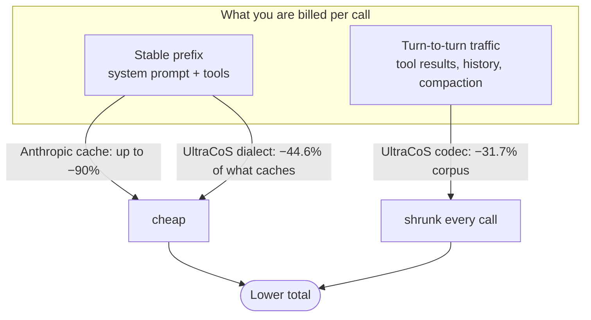

# UltraCoS — token-cost reduction for Claude Code

UltraCoS is a Claude Code plugin that lowers token cost across a session without
changing what the agent can see. It compacts tool-result output, removes repeated
content, and steers compaction toward a dense form — all **lossless by meaning**,
**fail-open** (any error passes the original through untouched), and fast (a
prebuilt native binary on the hot path, Python as the portable fallback).

It is **dogfooded in production daily** — the author runs it on their own Claude
Code traffic — and only recently open-sourced. Lossless-by-meaning and fail-open
are not aspirations; they are how it has had to behave to stay on every session.

It is free for noncommercial use (PolyForm Noncommercial 1.0.0); commercial use
needs a paid license — see [COMMERCIAL.md](COMMERCIAL.md).

---

> **Your agent's tool output is mostly noise** — ANSI codes, repeated reads,
> machine chatter, verbose compaction summaries. UltraCoS strips it **losslessly,
> on-device, before it bills** — and stacks *on top of* Anthropic's prompt cache.

| Measured | Reduction | On |
|---|---:|---|
| Tool-heavy session corpus (52 real fixtures) | **−31.7%** | total tokens 85,405 → 58,347 (`chars/4` proxy) |
| Large `Bash` dumps | **−71.1%** | the noisiest payloads |
| Instruction prose in the ULTRACOS-L1 dialect | **−44.6%** | every cached system-prompt call (Claude Opus tokens) |
| Network calls · API keys · data leaving your machine | **0** | 100% local, fail-open |

<sub>Char reduction is general; exact token % is **model-specific** — see [General vs model-specific savings](#general-vs-model-specific-savings). Numbers are reproducible from [`bench/`](./bench/) (`codec_bench.py`), not asserted; the project does not publish figures it has not measured.</sub>

## How it works

UltraCoS hooks the request lifecycle at six points; every one fails open
(`{"continue": true}` on any error — it can never block your input):


It does **not** fight Anthropic's cache — it works on a different token bucket.
Native caching discounts what is *already cached*; UltraCoS shrinks the
turn-to-turn traffic that changes every call and therefore *never* caches, plus
the dense form of what *does* get cached. The two stack:



The hot path is a prebuilt native binary; Python is the portable fallback:


## ULTRACOS-L1 — the symbolic dialect at the core

UltraCoS is named for its **CoS** — the *symbolic notation* it started as. ULTRACOS-L1
is a **lossless prose↔dense transcoder**: it rewrites verbose, repetitive
instruction-style prose (system prompts, `CLAUDE.md`, skill and agent files) into a
compact symbolic dialect the **same model decodes natively**, then expands it back
byte-for-byte.

```
expand(compress(x)) == x      # byte-identical for dialect content;
                              # unrecognized text passes through untouched
```

**Why it matters:** the system prompt ships on *every* request, and dense instructions
cost far fewer tokens while the model reads them just as well — so this is the only
*always-on, every-call* saving. Measured **−44.6% token reduction on dialect content**
(`opus-dialect-validate-2026-05-31`). It is the language behind the PreCompact
dense-form mandate and the `compress-config` command — and it is **where the whole
project began**. Every other mechanism (tool-result codec, dedup, the state-aware
gate) stacks on top of it.

**Model-specific dialects.** Tokenizers differ per model, so the dialect is a *data
file* the binary loads at runtime (`ULTRACOS_DIALECT`) — tune or ship a dialect for
your model with **no rebuild** (lossless self-check on load). `ultracos-core
dialect-export` dumps the default to edit; `ultracos-core compress` / `expand` run it
directly; `compress-config` applies it to your config files (dry-run + backup + lossless gate).

## Quickstart — first 5 minutes

```sh
claude plugin marketplace add MikkoParkkola/ultracos
claude plugin install ultracos
```

1. **Restart your session.** Hooks fire automatically — nothing to configure.
2. **Use Claude normally** for a few tool-heavy turns (reads, greps, bash).
3. **Check what it saved:** run `ultracos-stats` — it reads the append-only audit
   log and prints per-tool savings (so the effect is measured, not asserted).
4. **Tune aggressiveness** with `ultracos-set-level` if you want more or less.
5. **Verify losslessness yourself:** `echo "<dense prose>" | ultracos-core compress | ultracos-core expand` round-trips byte-for-byte.

Nothing leaves your machine; if anything errors, the original output passes
through untouched. To pause, set `ULTRACOS_DISABLE=1`.

## How it compares

Token reduction is a crowded, genuinely diverse space. UltraCoS is a **lossless,
in-process, agent-tool-result** compressor that stacks on native caching — it is
not trying to be a learned compressor or a hosted proxy. The honest landscape
(★ = GitHub stars, a maturity signal, not a quality verdict):

| Approach | Examples | Reversible? | Where it runs | Best at |
|---|---|---|---|---|
| **Lossless in-process codec** (this) | **UltraCoS** | yes (by meaning) | your machine, no hop | agent tool-results + dense compaction, stacked on cache |
| Lossless reversible pipeline | [claw-compactor](https://github.com/open-compress/claw-compactor) (2.2k★) | yes | varies | multi-stage general-text compression |
| Drop-in prompt compression | [leanctx](https://github.com/jia-gao/leanctx) (300★+) | varies | library | production-app prompt text |
| Learned / lossy compression | [LLMLingua / LLMLingua-2](https://github.com/microsoft/LLMLingua) (6k★) | no (drops tokens) | local model | aggressive prompt-text reduction where some loss is acceptable |
| Tool-call interceptor | [Crucible](https://github.com/Tetrahedroned/Crucible) | varies | in-process | nearest architecture to UltraCoS |
| Hosted edge proxy | Edgee, `rtk`-based | partial | network hop | one layer across multiple agents / clients |
| Output brevity ("caveman") | caveman, eridani-speak | no | varies | shrinking the model's *output* register |
| Spend visibility (**not** compression) | [claude-usage](https://github.com/phuryn/claude-usage) (1.7k★), ai-token-monitor | n/a | dashboard | *seeing* cost, not reducing it |
| Task offload | houtini-lm | n/a | local LLM | delegating bounded subtasks off the paid model |

Two honest notes:
1. **UltraCoS is small by star count** next to LLMLingua or claw-compactor — but it
   is **dogfooded in production daily on real Claude Code traffic**, not a research
   demo. Recently open-sourced, long battle-tested. It competes on being **lossless
   + in-process + zero-setup + cache-stacking**.
2. **These mostly compose.** A lossless codec, a learned compressor, and a spend dashboard solve different parts of the bill — running more than one is normal, not redundant. UltraCoS deliberately occupies the lossless-in-process slot and leaves the others to their strengths.

## General vs model-specific savings

Be precise about what is universal and what depends on the model:

- **The character reduction is general.** ANSI-strip, JSON-minify, dedup, and
  blank-collapse remove *characters* losslessly — that holds for any tokenizer,
  any model, any provider.
- **The exact token percentage is model-specific.** Tokens are not characters;
  every model tokenizes differently. The headline figures were measured on
  specific tokenizers: **−44.6% dialect** is in **Claude Opus** tokens
  (`opus-dialect-validate-2026-05-31`); **−31.7% corpus** uses a tokenizer-free
  `chars/4` proxy. Your model's real saving will differ — sometimes higher,
  sometimes lower.
- **Opus 4.7 / 4.8 ship their own tokenizers** (as do GPT's o200k, Gemini, etc.).
  The bundled [`calibration/`](calibration/) snapshot fits per-model
  `tokens-per-char` so the keep-vs-compact decision matches the *actual*
  tokenizer rather than a fixed 4-char assumption — and it is refreshed as model
  tokenizers move (they can change silently on a model update).

## The UltraCoS family

UltraCoS is a token-cost-reduction system for LLM coding agents. The pieces have
distinct roles:

- **UltraCoS Plugin** (this repo) — the free, client-side codec for Claude Code.
- **UltraCoS Verify** (`ultracos-verify`) — an MIT tool so savings can be verified
  independently, without trusting the provider.
- A managed offering — spend visibility and prompt-cache protection for teams
  running Claude Code at scale — is available on inquiry (see [COMMERCIAL.md](COMMERCIAL.md)).

The plugin is free and complete on its own; the rest is optional.

## Install

See [Quickstart](#quickstart--first-5-minutes) above — two commands, then restart
your session. `ultracos-stats` shows savings; `ultracos-set-level` tunes aggressiveness.

## What it does (the wired features)

UltraCoS registers six hook points; every one fails open.

| Hook | What it does |
|---|---|
| **PostToolUse — codec** | Compacts each tool result: ANSI strip, JSON minify, blank-collapse, shape-aware compaction (JSON / YAML / TOML / code / filesystem path-lists), oversize truncation, schema-tag. Runs as the native binary, Python fallback. |
| **PostToolUse — session dedup** | A repeated `Read`/`Grep`/`Glob`/`Monitor` result is replaced with a short reference to its earlier occurrence in the session. |
| **PreToolUse — history dedup** | Collapses duplicate context already carried in earlier turns before a tool runs. |
| **PreCompact — summary-form mandate** | When Claude Code compacts, UltraCoS injects an instruction to summarize in a dense, structured form. |
| **UserPromptSubmit — mode detector + stats** | Detects the active aggressiveness level and serves the `ultracos-stats` view. |
| **SessionStart — skill loader** | Loads the UltraCoS mode skill so the agent understands the dense conventions. |

### Safety: it can reduce tokens but never corrupt context

Two guards make this safe:

- **Break-even gating** — a transform is applied only when it saves enough tokens
  to be worth its schema tag. Below that, the original passes through verbatim.
- **Anchor-survival guard** — a compaction that would drop the load-bearing
  `file:line`, error code, identifier, that made the output useful is automatically
  reverted. Truncation is the only lossy step, and it is anchor-guarded.

## Architecture — and why there are Python files

UltraCoS is **Rust-first, Python-fallback**:

- The hot-path codec ships as **prebuilt native binaries** under
  [`bin/<triple>/`](bin/) (macOS and Linux, arm64 and x86_64). The PostToolUse hook
  runs the binary by default — roughly `5 ms` per call versus `~170 ms` to launch a
  Python interpreter, with identical output.
- The **Python codec is the portable fallback** — used on an unsupported platform,
  a missing binary, an `exec` denied by policy, or `ULTRACOS_RUST=0`. So
  `hooks/PostToolUse/ultracos_codec.py` and the modules it imports (cache, dedup,
  anchor-guard, tokenizer, paths) exist so the plugin still works where the binary
  cannot run. Every path is fail-open.
- The **lightweight glue hooks** (skill loader, mode detector, stats handler,
  history dedup, PreCompact mandate) are Python because they are trivial and not on
  the per-tool-result hot path; a native port would buy nothing.

Binaries are reproducible from the in-repo source via [`bin/build.sh`](bin/build.sh)
and verified by [`bin/SHA256SUMS`](bin/SHA256SUMS). The codec source is fully open —
[`ultracos-core/`](ultracos-core/) — read every line.

## Cache safety — why it can't bust your prompt cache

Anthropic's prompt cache is the biggest token-cost lever there is, and mutating an
already-cached prefix forces a full re-fetch at creation price — the worst failure
mode in this space. **UltraCoS is cache-safe by construction, not by a flag:**

- The codec acts only on **fresh tool-result output** (the appended tail), never on
  the system-prompt / tool-definition prefix that gets cached.
- Compaction is **deterministic** — the same payload always compacts to the same
  bytes, so a tool result that later becomes part of a cached prefix stays stable.
- **Session-dedup back-references the *repeat*** (`[seen earlier this session]`) and
  never rewrites the earlier occurrence — the potentially-cached copy is untouched.
- **History-dedup only appends an advisory note**; it does not rewrite prior turns.
- The user-visible reply is never compressed.

`ULTRACOS_CACHE_AWARE` (below) is optional defense-in-depth — a heuristic that backs
off on prefixes it *infers* are cache-hot. It is **off by default because the
structural guarantees above already protect the cache**, and the heuristic cannot
see Anthropic's real cache state (it awaits `usage.cache_read_input_tokens`). Turn it
on for belt-and-suspenders; you do not need it for correctness.

## Configuration

| Env var | Default | Effect |
|---|---|---|
| `ULTRACOS_RUST` | on | Set `0` to force the Python codec. |
| `ULTRACOS_ANCHOR_GUARD` | on | Set `0`/`off` to disable the anchor-survival revert (not recommended). |
| `ULTRACOS_CACHE_AWARE` | off | Optional defense-in-depth: backs off compaction on inferred cache-hot prefixes. Off because the codec is already cache-safe by construction (see [Cache safety](#cache-safety--why-it-cant-bust-your-prompt-cache)); on adds per-call disk I/O. |
| `ULTRACOS_DATA_DIR` | `~/.ultracos` | Where the audit log and state live. |

## Calibration — a published snapshot, kept current as a service

The codec's keep-vs-compact boundary uses a token estimate. UltraCoS ships a
**calibration snapshot** ([`calibration/`](calibration/)): per-model
`tokens-per-char` values fitted from real, model-billed token counts, so the
estimate matches a model's actual tokenizer rather than a fixed assumption. The
fallback, when no snapshot value applies, is the classic 4-characters-per-token
estimate.

**Public vs private.** The codec source, the published snapshot (numbers, schema,
version), this methodology, and the fallback are all here and inspectable. The data,
the fitting method, and the pipeline that *produce* the snapshot are not — that is
what makes a snapshot a result you can use but not regenerate. See
[METHODOLOGY.md](METHODOLOGY.md).

**It is a service.** A model's tokenizer can change with a model update, with no
changelog. The snapshot is therefore refreshed as model tokenizers change. A frozen
copy keeps working under the license; a refreshed one tracks the change.

Every published value is fitted from measured counts. The project does not publish
performance figures it has not measured.

## Observability

UltraCoS writes an append-only audit row per compaction event (savings per tool,
shape, version) so its effect is measurable, not asserted. `ultracos-stats` reads it.

## FAQ

**How do I reduce Claude Code token costs?**
Install UltraCoS (`claude plugin install ultracos`). It losslessly compacts
tool-result output, deduplicates repeated context, and compresses the system
prompt — stacking on top of Anthropic's prompt cache. No API key, no signup.

**Is it lossless? Does it change what the agent sees?**
The codec is lossless by meaning: `expand(compress(x)) == x` for dialect content,
and unrecognized text passes through untouched. Truncation is the only lossy step
and it is anchor-guarded (it reverts if it would drop a `file:line` or error
code). The user-visible reply is never compressed.

**Does it work with models other than Claude?**
The character-level reductions (ANSI-strip, dedup, JSON-minify) are general and
work with any model and provider. The exact token percentage is model-specific
because each model tokenizes differently; a per-model calibration snapshot keeps
the estimate honest. See [General vs model-specific savings](#general-vs-model-specific-savings).

**How much does it actually save?**
−31.7% on a 52-fixture tool-heavy corpus, −71.1% on large `Bash` dumps, −44.6% on
instruction prose in the dialect (Claude Opus tokens). Your numbers depend on
your workload and model — run `ultracos-stats` to measure your own.

**How is it different from LLMLingua, claw-compactor, or a proxy like Edgee?**
LLMLingua is a learned, *lossy* prompt compressor (it drops tokens); UltraCoS is
lossless and in-process. claw-compactor is a lossless multi-stage pipeline;
UltraCoS targets agent tool-results + compaction specifically and stacks on the
cache. Edgee is a hosted edge proxy (network hop); UltraCoS runs on your machine
with no hop. They compose — see [How it compares](#how-it-compares).

**Does it send my data anywhere?**
No. 100% local, zero network calls, zero API keys. Tool output never leaves your
machine. Every path is fail-open: on any error the original passes through.

**Can I compress my `CLAUDE.md` / skills / agent files?**
Yes — `ultracos-core compress-config <file>` previews savings (dry-run by
default), and `--apply` writes them behind a lossless gate with an automatic
`.ultracos.bak` backup. The system prompt ships on every request, so this is the
only always-on saving.

## License

**PolyForm Noncommercial License 1.0.0** — free for any noncommercial use.
Commercial use requires a paid license: see [COMMERCIAL.md](COMMERCIAL.md) or
contact **mikko.parkkola@iki.fi**. Full text in [LICENSE](LICENSE).
